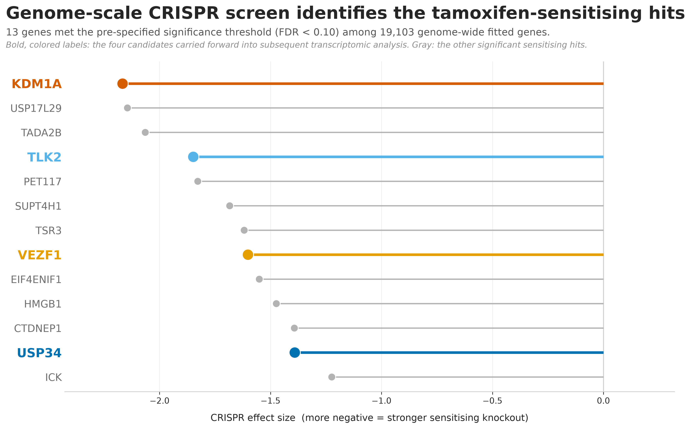
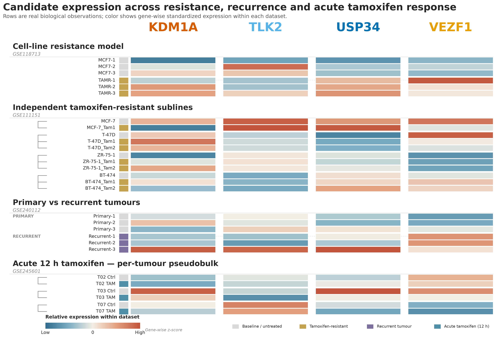
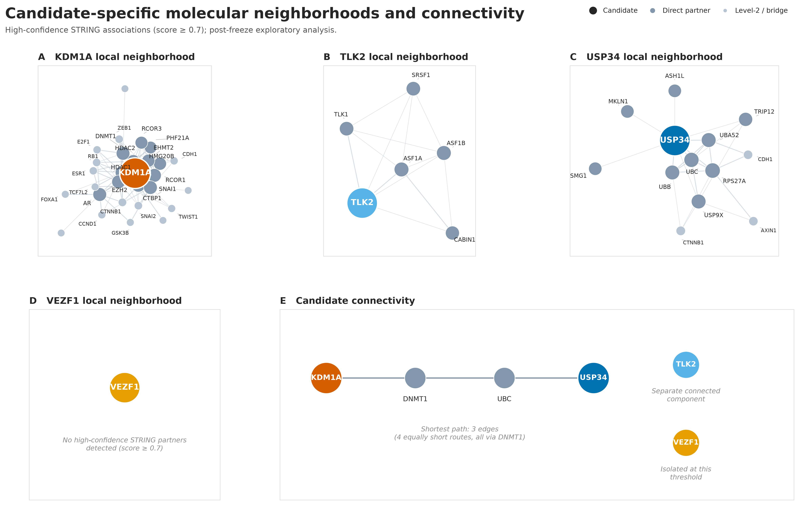
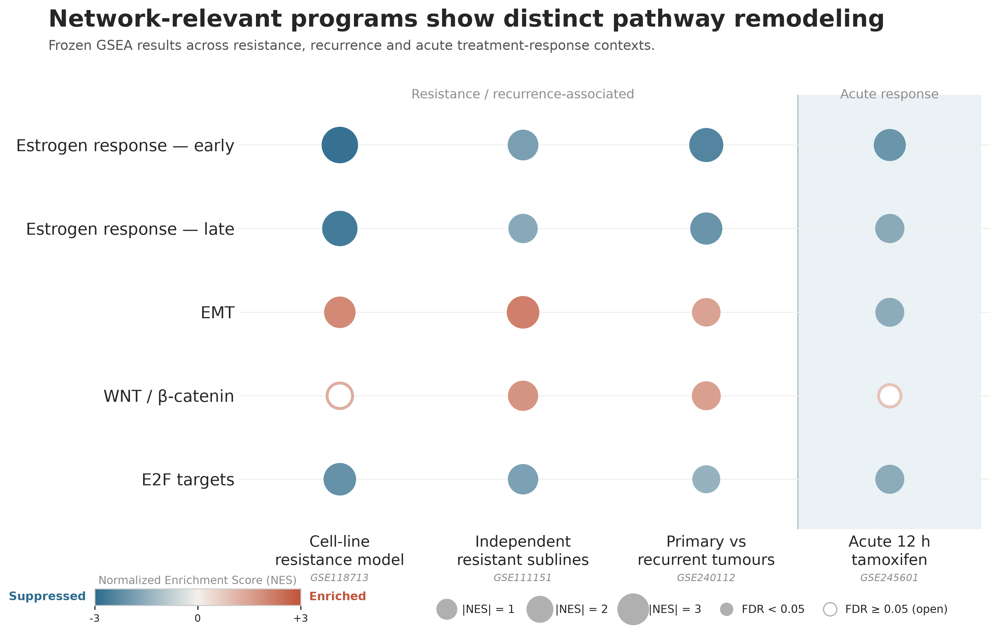
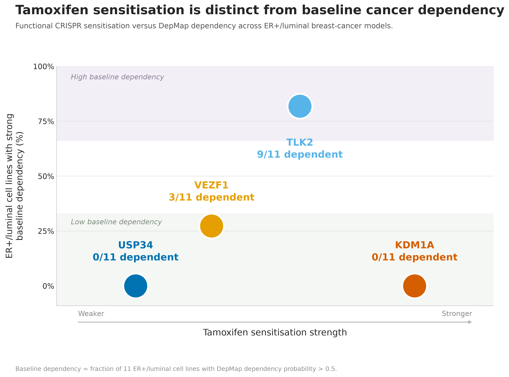
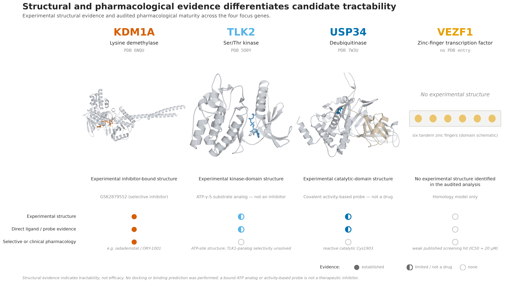

# Final Poster Figures

Six figures tell one story: a genome-scale CRISPR screen identifies gene
knockouts that sensitise ER+ breast-cancer cells to tamoxifen (**01**); the
four focus genes are then followed across resistance-model, recurrence-associated
and acute-treatment transcriptomic contexts (**02**); their local molecular
neighbourhoods are mapped (**03**); the biological programs those neighbourhoods
implicate are checked in the transcriptomic data (**04**); tamoxifen
sensitisation is separated from baseline cancer-cell dependency (**05**); and
finally each candidate's structural/pharmacological tractability is assessed
(**06**).

Focus genes: **KDM1A, TLK2, USP34, VEZF1**.

Canonical files: [`final_figures/`](final_figures/) ·
Provenance and hashes: [`figure_manifest.tsv`](figure_manifest.tsv)

> These are computational reanalyses of public data. Nothing here is a
> validated therapeutic target, a proven mechanism, or evidence of drug
> safety or efficacy.

---

## Figure 1 — CRISPR discovery


- **Question:** Which gene knockouts sensitise ER+ breast-cancer cells to tamoxifen?
- **Main result:** 13 genes met the pre-specified threshold (FDR < 0.10, negative
  effect) among 19,103 genome-wide fitted genes. KDM1A ranks 1st by effect size,
  TLK2 4th, VEZF1 8th, USP34 12th.
- **Source:** frozen CRISPR gene-level results (Hany et al. screen, E2+4-OHT vs E2).
- **Renderer:** `src/poster_crispr_discovery_v1.py` → `scripts/poster/01_crispr_discovery.py`

## Figure 2 — Candidate expression


- **Question:** How do the four candidates behave across resistance, recurrence and acute tamoxifen response?
- **Main result:** 29 real biological observations across four datasets; colour is
  gene-wise z-score **within each dataset**, so it shows relative position inside a
  dataset and never cross-dataset absolute expression.
- **Source:** GSE118713, GSE111151, GSE240112, GSE245601 processed expression.
- **Renderer:** `src/poster_hero_heatmap_v6.py` → `scripts/poster/02_candidate_expression.py`

## Figure 3 — Molecular networks *(post-freeze exploratory)*


- **Question:** What molecular neighbourhood surrounds each candidate, and are those neighbourhoods connected?
- **Main result:** One standardized STRING query (species 9606, score ≥ 0.7) applied
  identically to all four genes gives 47 nodes / 147 edges / 3 components. KDM1A and
  USP34 sit in one component (shortest path 3 edges; 4 equally short routes, all via
  DNMT1); TLK2 forms a separate component; VEZF1 has **zero** partners at this
  threshold.
- **Source:** `data/reference/interactions/string_v2_level{1,2}_*.tsv`
- **Renderer:** `src/poster_network_mechanism_v4.py` → `scripts/poster/03_molecular_networks.py`

## Figure 4 — Pathway remodeling


- **Question:** Do the biological programs implicated by the networks change in the transcriptomic contexts?
- **Main result:** Estrogen response (early and late) is suppressed in all four
  contexts. EMT is enriched in the three resistance/recurrence contexts and
  suppressed in the acute 12 h context. E2F targets are suppressed in all four.
  WNT/β-catenin is weak and mixed (significant in GSE111151 and GSE240112 only).
- **Source:** frozen GSEA tables, `results/tables/systems_network/gsea_*.tsv`
- **Renderer:** `src/poster_pathway_v2.py` → `scripts/poster/04_pathway_remodeling.py`

## Figure 5 — Baseline dependency


- **Question:** Does tamoxifen sensitisation occur in genes cancer cells already depend on at baseline?
- **Main result:** Across 11 ER+/luminal DepMap 26Q1 lines (dependency probability
  > 0.5), KDM1A 0/11 and USP34 0/11 show no strong baseline dependency, TLK2 9/11
  does, VEZF1 3/11 is intermediate. KDM1A and TLK2 are both strong sensitisers yet
  differ sharply here.
- **Source:** DepMap 26Q1 + frozen CRISPR effects.
- **Renderer:** `src/poster_depmap_v2.py` → `scripts/poster/05_depmap_dependency.py`

## Figure 6 — Structural tractability


- **Question:** Can these candidate vulnerabilities realistically be targeted?
- **Main result:** KDM1A has an inhibitor-bound experimental structure (6NQU,
  GSK2879552) and clinical-stage selective inhibitors. TLK2 has an experimental
  kinase-domain structure (5O0Y) bound to an ATP analog, not an inhibitor. USP34 has
  an experimental catalytic-domain structure (7W3U) with a covalent activity-based
  probe at Cys1903, not a drug. VEZF1 has no experimental structure in the audited
  evidence.
- **Source:** `results/tables/post_audit_sensitivity/06b_structural_tractability_audit.tsv` + local PDB files.
- **Renderer:** `src/poster_druggability_v1.py` → `scripts/poster/06_structural_tractability.py`

---

## Interpretation boundaries

- The CRISPR screen asks whether knockout makes tamoxifen work **better** in a
  parental/drug-tolerant MCF7-V context (E2+4-OHT vs E2). It does **not** show
  reversal of established acquired tamoxifen resistance.
- GSE118713 and GSE111151 are cell-line models, not independent human validation.
  GSE111151 candidate differential expression was largely null.
- GSE240112 compares primary vs recurrent tumours from **different, unpaired**
  patients. It is recurrence-**associated**, not a controlled tamoxifen-resistance
  experiment and not evidence of tamoxifen causality.
- GSE245601 is an **acute 12 h, 10 µM ex vivo** exposure, not chronic or acquired
  resistance. The rows shown are per-tumour pseudobulk, not individual cells.
- Expression association is not causation; expressed is not differentially
  expressed; and transcriptomic corroboration is not biologically required for a
  functional CRISPR sensitiser.
- STRING edges are **undirected functional associations** — not activation, not
  inhibition, not necessarily physical binding. A shortest path is not a proven
  mechanism.
- Baseline DepMap dependency is **not** tamoxifen-specific sensitisation and **not**
  normal-tissue toxicity or safety. Low dependency does not prove specificity, and
  high dependency is not automatically "better". TLK2 being the most
  baseline-dependent applies **only among these four focus genes** — the wider
  13-hit set contains more dependent genes (e.g. SUPT4H1).
- Structural tractability is not efficacy. Partial-domain structures are not
  full-length structures, and homology/AlphaFold models are not shown as
  equivalent to experimental ones.
- GDSC and TCGA are supporting/exploratory only and are deliberately **not** part
  of these six figures. GDSC USP34 signals were GDSC1-only with no GDSC2
  replication.

## Reproducing the figures

From the repository root, with the `bc` conda environment active:

```bash
# rebuild all six, copy to poster/final_figures/, refresh the manifest
python scripts/poster/build_all.py

# verify existing outputs and hashes without re-rendering
python scripts/poster/build_all.py --check

# rebuild one figure
python scripts/poster/02_candidate_expression.py
```

**Reproducibility of the hashes.** `figure_manifest.tsv` records the SHA-256 of
every published file. PNG output is byte-reproducible, so a rebuilt PNG matches
its recorded hash exactly. PDF is reproducible only because `build_all.py` pins
`SOURCE_DATE_EPOCH` (matplotlib otherwise stamps a wall-clock creation date),
and **SVG is not byte-reproducible at all** — matplotlib emits per-run element
ids. A changed PDF/SVG hash after re-rendering therefore does not indicate a
changed figure; the PNG hash and the underlying source tables are the meaningful
checks.

One further exception: **Figure 03's PNG is also not byte-reproducible**, because
its label placement uses `adjustText`, whose collision solver gives slightly
different label pixel positions on each run. Removing the solver was tested and
rejected (it reintroduces real label collisions such as `HDAC1` over the KDM1A
node). The network itself — nodes, edges, scores, components and shortest paths —
is fully deterministic and is asserted directly in
`tests/test_poster_network_mechanism_v4.py`.

Figure 6 reuses the PyMOL renders already committed under
`results/figures/poster_druggability_v1/renders/`. To regenerate those you need
the local PDB files plus PyMOL:
`python scripts/render_druggability_structures.py`.

## Frozen versus post-freeze analyses

| Layer | Status |
|---|---|
| CRISPR gene-level results (Figure 1) | **frozen** (tag `science-freeze-2026-08-15`) |
| Expression, pathway, DepMap, structure figures (2, 4, 5, 6) | **derived from frozen** data — new visualisations, no new science |
| STRING network analysis (Figure 3) | **post-freeze exploratory** — a new standardized query run after the freeze |

The historical frozen evidence-only shortlist was **USP34, VEZF1, EML5, CITED2**.
The current poster focus genes (**KDM1A, TLK2, USP34, VEZF1**) were set after the
post-audit reinterpretation; they are *not* the original frozen shortlist, and no
frozen ranking or value was altered to produce them. See the root
[`README.md`](../README.md#scientific-freeze) and
[`docs/FINAL_PUBLIC_REPO_AUDIT.md`](../docs/FINAL_PUBLIC_REPO_AUDIT.md).
